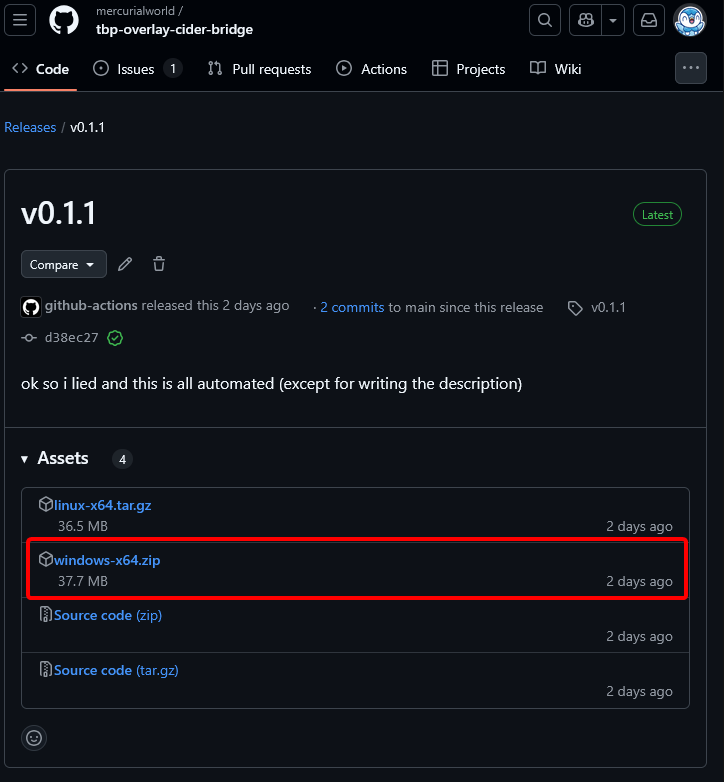
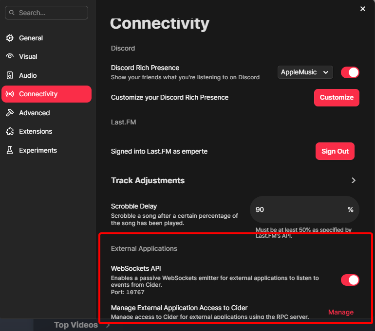
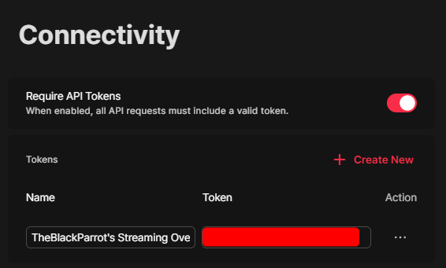

# Setup

## Download

In the [releases page](https://github.com/mercurialworld/tbp-overlay-cider-bridge/releases), download the files for your operating system. (I'm assuming you're using Windows, so you'll want to download the `windows-x64.zip` file.)



Regardless of which operating system you're using, the contents of the compressed folder are as follows. Make sure you put these two files in the same folder, beside each other, when you extract them:

```
windows-x64.zip
├── config.json
└── tbpciderbridge.exe
```

## Config 

The `config.json` is formatted as follows:

```jsonc
{
    "ciderURL": "http://127.0.0.1",
    "ciderPort": 10767,
    "ciderAppToken": "pasdmhnwetczxewrqupweasv", // this is not a real token

    "parrotURL": "127.0.0.1",
    "parrotPort": 42069
}
```

`ciderURL` and `ciderPort` are the address/URL and port of Cider's Socket.io server, respectively. `ciderAppToken` is the app token to authenticate yourself for its separate API server.[^1]

[^1]: The API is so you can get the song currently playing when you connect to Cider's websocket, because by default, the websocket does not give you the song. That is the *only* time the API is used. This is literally what the [official Stream Deck integration](https://github.com/ciderapp/CiderDeck/blob/main/src/sh.cider.streamdeck.sdPlugin/app.js) does as well.

`parrotURL` and `parrotPort` are for the websocket that Parrot's overlay will listen to. 

> [!WARNING]
> If you are on Linux, **you must have a protocol in front of the URL/IP address (`http://`) for the `ciderURL` variable!** (I'm unsure if this is needed on Windows, but I'd assume so.) **`parrotURL` does not need a protocol, please do not add `http://` or `ws://` in front.**

## Cider

> [!IMPORTANT]
> This is for v2 of Cider, that is, the paid version. If anyone wants this for v1, let me know via an issue or in the Discord server (see [Support](#support)).



In the Connectivity section of the Settings panel in Cider 2.0, enable the "WebSockets API" option in the "External applications" section. Take a note of the port if it isn't `10767`.

Click on the "Manage" button to the right of "Manage external application access to Cider", and you'll see a screen where you manage app tokens.



Your screen may not look like mine, so if it doesn't, click on "Create New" and enter whatever descriptive name you want to use. After that, there should be a row with the app name you entered earlier, and a token. Copy the token and make that the `ciderAppToken` in your `config.json`.

## Parrot's Stream Overlay


Under the "External Music Player" part of the **Connections** section, make sure to enable the **"Override music information with external player information"** setting. You can set the IP address/port to whatever you want, as long as you also change it in `config.json`.

## Running the program

All that's left is to double-click on the `tbpciderbridge` executable. A terminal should pop up. If there's something wrong, you'll have to close the terminal, edit the `config.json`, and relaunch the program -- "hot reloading" will probably come in a later release.

# Support

If you still need help, give me (`@mercurial_world`) a mention in the #other-support channel in Parrot's overlay support Discord server, which you can find through [the overlays page](https://theblackparrot.me/overlays/).